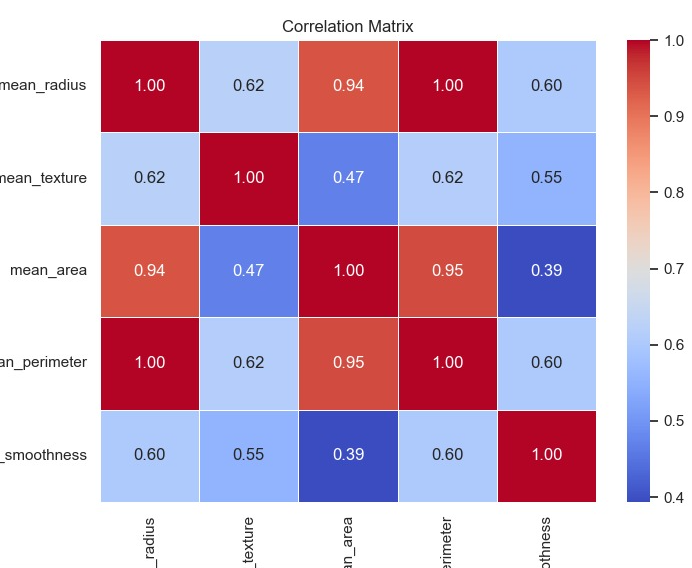
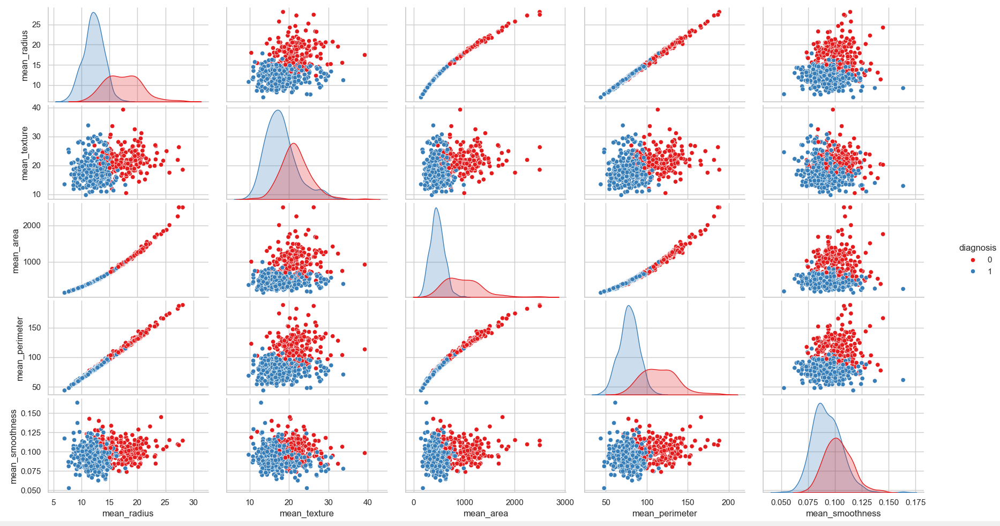

# Breast Cancer Classification

### Autore
[Fabio Zippo](https://github.com/IXRyu) - MAT 776951 

email: fabiozippo03@hotmail.com

Occupazione: Studente presso l'Università degli Studi di Bari [Aldo Moro](https://www.uniba.it/it)

## Indice

- ### [Introduzione](#1---introduzione)
    - [1.1 - Il tumore al seno](#11---il-tumore-al-seno)
    - [1.2 - Caratteristiche](#12---caratteristiche-principali-per-la-diagnosi)
    - [1.3 - Obiettivo del Progetto](#13---obiettivo-del-progetto)

- ### [Analisi Dataset](#2---analisi-dataset)
    - [2.1 - Elenco Dati](#21---elenco-dati)
    - [2.2 - Analisi dei Dati](#22---analisi-dei-dati)
    - [2.3 - Preprocessing](#23---pre-processing)

- ### [Apprendimento Supervisionato]()
  - [Approccio](#approccio) 
  - [Suddivisione dei Dati](#suddivisione-dei-dati)
  - [Scelta dei Modelli](#scelta-dei-modelli)
  - [Tuning degli Iperparametri](#tuning-degli-iperparametri)
  - [Addestramento & Test dei Modelli](#addestramento-dei-modelli)
  - [Valutazione dei Modelli](#valutazione-dei-modelli)
  - [Confronto dei Modelli](#confronto-dei-modelli)
    - [Decision tree](#decision-tree)
    - [Random forest](#random-forest)
    - [Logistic regression](#logistic-regression)
    - [Support vector machine](#support-vector-machine-svm)
    - [Artificial neural network](#artificial-neural-network-ann)
  - [Conclusioni](#conclusioni)

- **Capitolo 3 - Ragionamento Probabilistico**
    - [Motivazioni](#motivazione)
    - [Approccio](#approccio)
    - [Pareri e conclusioni](#pareri-e-conclusioni)

- **Capitolo 4 - Knowledge Base**
  - [Costruzione della Knowledge Base](#costruzione-della-knowledge-base)
  - [Fatti e Regole](#fatti-e-regole)
  - [Esempi di query](#esempi-di-query)
  - [Upgrade](#possibili-upgrade)

- **Capitolo 5 - Conclusioni**
    - [Risultati Ottenuti](#risultati-ottenuti)
    - [Possibili Sviluppi Futuri](#possibili-sviluppi-futuri)

## 1 - Introduzione
Il progetto ha come obiettivo la categorizzazione della natura, benigna o maligna, di un tumore al seno dati determinati fattori, utilizzando tecniche di machine learning. Il [Dataset](https://www.kaggle.com/datasets/merishnasuwal/breast-cancer-prediction-dataset) utilizzato in questo progetto è un dataset pubblico sul cancro al seno

## 1.1 - Il Tumore al Seno

Il tumore al seno è una delle principali cause di mortalità femminile a livello globale ed è caratterizzato dalla crescita incontrollata di cellule anomale nei tessuti mammari. La diagnosi precoce è fondamentale per migliorare le possibilità di trattamento e aumentare il tasso di sopravvivenza.

Per distinguere tra tumori benigni e maligni, i medici e i ricercatori analizzano una serie di caratteristiche ottenute attraverso esami, come la mammografia o l'analisi microscopica delle cellule tumorali. Queste feature includono proprietà fisiche e strutturali delle cellule, che forniscono informazioni cruciali sulla natura del tumore.

## 1.2 - Caratteristiche Principali per la Diagnosi

Tra le principali feature utilizzate per la diagnosi troviamo:

- **Mean Radius (Raggio Medio)**: Dimensione media delle cellule tumorali. I tumori maligni tendono ad avere un raggio maggiore rispetto a quelli benigni.
- **Mean Perimeter (Perimetro Medio)**: Misura del contorno delle cellule, utile per valutare la loro irregolarità.
- **Mean Area (Area Media)**: La superficie media delle cellule tumorali, spesso più grande nei tumori maligni.
- **Mean Texture (Testura Media)**: Variazione dell'intensità nei pixel dell'immagine, utile per identificare anomalie nella struttura cellulare.
- **Mean Smoothness (Morbidezza Media)**: Indica quanto i bordi delle cellule sono regolari o frastagliati. I tumori maligni spesso mostrano bordi più irregolari.

## 1.3 - Obiettivo del Progetto

L'analisi di queste feature consente di addestrare modelli di intelligenza artificiale per classificare i tumori in benigni o maligni con un'elevata precisione. Tecniche di apprendimento supervisionato come:

- **Decision Tree**
- **Random Forest**
- **Support Vector Machines (SVM)**
- **Logistic Regression**
- **K-Nearest Neighbors (KNN)**

insieme a modelli avanzati come **Reti Neurali** e **Reti Bayesiane**, possono essere utilizzate per migliorare l'affidabilità della diagnosi automatizzata.

L'obiettivo di questo progetto è sviluppare e confrontare diversi modelli di classificazione per identificare con precisione la natura del tumore, fornendo un supporto utile ai medici nella diagnosi precoce del cancro al seno.

### 2 - Analisi Dataset

## 2.1 - Elenco Dati

- Il dataset è composto da 570 record e 6 Features.

| **Feature**                                          | **Descrizione**                                                                                                                             | **Dominio**                                                                               |
|------------------------------------------------------|---------------------------------------------------------------------------------------------------------------------------------------------|-------------------------------------------------------------------------------------------|
| **mean_radius**                                          | Raggio medio delle cellule tumorali                                                                                                      | Valori interi                                                                                 |
| **mean_perimeter**                                          | Misura del contorno delle cellule                                                                                             | Valori interi                                                                                    |
| **mean_texture**                                              | Variazione dell'intensità nei pixel dell'immagine                                                                                             | Valori interi                                                                                |
| **mean_area**                                             | La superficie media delle cellule tumorali | Valori interi                                                                  |
| **mean_smoothness**                                             | Indica quanto i bordi delle cellule sono regolari o frastagliati                                                                                                      | Valori reali                                                                       |
| **diagnosis**                                            | Natura del tumore(benigna/maligna)                                                                                                    | {0,1}                                                                       |

## 2.2 - Analisi dei Dati

### Matrice di Correlazione delle Feature

Questa matrice di correlazione mostra le relazioni tra diverse feature estratte per la diagnosi del tumore al seno. La correlazione è rappresentata da valori compresi tra 0 e 1:

- **1.0** indica una forte dipendenza.
- **0.0** indica nessuna correlazione.

I colori della matrice aiutano a visualizzare l'intensità delle correlazioni:
- **Rosso scuro** rappresenta una forte correlazione.
- **Blu** rappresenta una correlazione più debole.

## Osservazioni principali:
1. **Alta correlazione tra `mean_radius`, `mean_perimeter` e `mean_area`**   
   - Questo suggerisce che il raggio, il perimetro e l'area sono caratteristiche altamente dipendenti e potrebbero ridondare nei modelli di machine learning, utile tener conto delle dipendenze per la rete Bayesiana

2. **Correlazioni moderate con `mean_texture` e `mean_smoothness`**  

Questa matrice aiuta a comprendere come le diverse caratteristiche sono legate tra loro, fornendo informazioni preziose per la selezione delle feature nei modelli di classificazione.

### Pairplot

Questa matrice di grafici a dispersione (**pairplot**) rappresenta le relazioni tra diverse feature del dataset utilizzato per la classificazione del tumore al seno. Le osservazioni sono colorate in base alla diagnosi:  
- **Blu** (1) indica tumori benigni.  
- **Rosso** (0) indica tumori maligni.  

### Osservazioni Principali:
1. **Distribuzioni univariate**  
   - Lungo la diagonale troviamo le distribuzioni di ogni singola feature.  
   - Si nota che alcune variabili, come `mean_radius`, `mean_area` e `mean_perimeter`, mostrano una distribuzione differente tra tumori benigni e maligni.

2. **Relazioni tra le variabili**  
   - Esistono forti correlazioni tra alcune variabili, in particolare tra `mean_radius`, `mean_area` e `mean_perimeter`.  
   - La relazione tra `mean_radius` e `mean_area` appare quasi perfettamente lineare, il che suggerisce che una delle due potrebbe essere ridondante nei modelli di classificazione.

3. **Separabilità tra classi**  
   - Alcune feature, come `mean_radius` e `mean_area`, sembrano offrire una buona separazione tra le classi, con i tumori maligni tendenti a valori più elevati rispetto ai benigni.  
   - Altre feature, come `mean_texture` e `mean_smoothness`, mostrano una maggiore sovrapposizione tra le due classi, suggerendo che da sole potrebbero non essere buoni predittori.

### Utilità per la Modellizzazione:
- Questo tipo di analisi è utile per comprendere quali feature sono più informative per la classificazione.
- Potrebbe essere utile applicare tecniche di selezione delle feature o trasformazioni come PCA per ridurre la collinearità tra variabili fortemente correlate.

### 📌 Conclusione:
Il pairplot fornisce un'ottima panoramica delle relazioni tra feature e della distribuzione delle classi, aiutando a identificare quali variabili possono essere più utili per i modelli di machine learning nella classificazione del tumore al seno.
Ho ritenuto opportuno tenere le feature ridondanti per via della scarsa presenza di feature

## 2.3 - Pre-Processing

## Preprocessing dei Dati

Il processo di **preprocessing dei dati** è fondamentale per garantire che il dataset sia pulito, bilanciato e pronto per l'addestramento dei modelli di machine learning. Il codice implementa diverse operazioni di preprocessing, suddivise nei seguenti passaggi chiave:

1. **Gestione dei valori mancanti**:  
   I dati vengono ripuliti rimuovendo eventuali valori mancanti (`NaN`), garantendo così che il dataset sia completo e coerente.

2. **Normalizzazione delle feature**:  
   Per garantire che tutte le feature abbiano una scala comparabile, viene applicata una **standardizzazione** utilizzando lo `StandardScaler()`. Questo metodo trasforma ogni feature affinché abbia media zero e varianza unitaria, migliorando la stabilità dell'addestramento dei modelli.

3. **Suddivisione del dataset**:  
   I dati vengono divisi in **training set (70%)** e **test set (30%)** utilizzando `train_test_split()`. Questo passaggio è essenziale per valutare le performance del modello su dati non visti.

4. **Espansione del dataset (opzionale)**:  
   È presente una funzione `augment_dataset()` che genera dati sintetici moltiplicando alcune feature (`mean_radius`, `mean_smoothness`, `mean_perimeter`, `mean_area`, `mean_texture`) per dei fattori di scaling, con l'obiettivo di migliorare la robustezza del modello.

Questo flusso di preprocessing assicura che il dataset sia pronto per l'addestramento di modelli di classificazione, migliorando la qualità e l'affidabilità dei risultati ottenuti.

## 3 - Apprendimento Supervisionato - Classificazione Binaria

Questo progetto utilizza l'apprendimento supervisionato per creare modelli di classificazione binaria. L'obiettivo è addestrare vari modelli di classificazione, ottimizzare i loro iperparametri e testare le loro prestazioni su un dataset di test.

### 3.1 - Modelli Implementati

I modelli utilizzati sono:

- Usati perchè solidi con i problemi di classificazione binaria.
  - **Support Vector Machine**: è un modello che cerca di trovare il miglior iperpiano che separa i dati in due classi.
  - **Logistic Regression**: è un modello di classificazione che si basa su una funzione logistica.

- Usati perchè si vuole vedere se ci sono differenze significative tra i modelli.
  - **Albero Decisionale**: è un modello che costruisce un albero di decisione in base alle features.
  - **Random Forest**: è un modello di classificazione che si basa su un insieme di alberi decisionali è usato perché molte volte gli alberi decisionali sono molto sensibili ai dati e posso andare in overfitting.
  - **k-NN**: è un modello che classifica un punto dati in base alla maggioranza dei suoi vicini più prossimi nel set di dati

- **SVM** e **Logistic Regression** probabilmente performeranno meglio in questo problema e solitamente richiedono uno sforzo computazionale minore rispetto ad altri approcci.

Invece: 

- **Albero Decisionale** può presentare overfitting.
- **Random Forest** è un modello composto da più alberi decisionali per mitigare l' overfitting.
- **k-NN** potrebbe avere buone performance su dataset con confini decisionali semplici come questo

### 3.2 - Tuning degli Iperparametri

Per trovare i migliori iperparametri per i modelli ho utilizzato la tecnica di **GridSearch**, che esplora tutte le combinazioni possibili di iperparametri sebbene con alta complessità esponenziale, tuttavia il dataset è molto piccolo ed è quindi appropriato utilizzarlo

### 3.3 - Addestramento

Ho addestrato i modelli sui dati attraverso la **k-fold cross validation** con **k = 10**

Nell'apprendimento non c'è stato un costo computazionale esagerato

### 3.4 - Valutazione dei Modelli

Per valutare i modelli ho utilizzato le seguenti metriche:

- Learning curve per osservare se il modello presenta overfitting o underfitting.
  - **Precision**: è la percentuale di predizioni positive fatte dal modello che sono corrette.
  - **Recall**: è la percentuale di predizioni positive corrette fatte dal modello rispetto a tutte le predizioni positive.
  - **F1**: è la media armonica tra precision e recall.

### 3.5 - Confronto Modelli

Per ogni modello si andrà a mostrare:
- **Iperparametri**: Impostati prima dell'allenamento e influenzano il processo di apprendimento
- **Matrice di Confusione**: Mostra la distribuzione di valori predetti e reali giusti e errati
- **Metriche**: Accuracy, Precision, Recall e F1
- **Curva ROC**: Receiver Operating Characteristic, si considera il grafico con il false positive rate sulle ascisse, le x, e del true positive rate sulle ordinate, i modelli peggiori in basso a destra
- **Curva Precision-Recall**: La precision è sulle ascisse e la recall è sulle ordinate. I modelli peggiori si trovano in basso a sinistra
- **Learning Curve**: Errore commesso all'aumentare del training size, per verificare overfitting

### 3.5.1 - Albero Decisionale

#### Iperparametri

- **`criterion`**: definisce la funzione di valutazione per la qualità della divisione nei nodi dell'albero. Può essere:
  - **`gini`**: indice di Gini, misura l'impurità del nodo.
  - **`entropy`**: entropia, misura l'incertezza della suddivisione.
  - **`log_loss`**: log-loss, utilizzato per la regressione logistica.

- **`max_depth`**: indica la profondità massima dell'albero, limitando il numero di livelli di nodi. Un valore più alto consente più complessità, ma rischia di causare overfitting.

- **`min_samples_split`**: stabilisce il numero minimo di campioni richiesti per dividere un nodo. Un valore maggiore riduce la complessità dell'albero, evitando suddivisioni troppo specifiche e migliorando la generalizzazione.

### 3.5.2 - Random Forest

#### Iperparametri
- **`n_estimators`**: indica il numero di alberi nella foresta casuale. Maggiore è il numero, migliore tende a essere la performance, ma aumenta anche il tempo di calcolo. 

- **`max_depth`**: definisce la profondità massima di ogni albero nella foresta. Un valore maggiore può portare a un modello più complesso, ma può anche causare overfitting.

- **`min_samples_split`**: stabilisce il numero minimo di campioni necessari per suddividere un nodo. Un valore più alto evita suddivisioni troppo specifiche, migliorando la generalizzazione e riducendo l'overfitting.

### 3.5.3 - Logistic Regression

#### Iperparametri

- **`penalty`**: specifica il tipo di regularizzazione da applicare. 
  - **`l1`**: regularizzazione Lasso, che può portare a modelli sparsi, eliminando alcune variabili.
  - **`l2`**: regularizzazione Ridge, che riduce il peso delle variabili, ma non le elimina.

- **`C`**: parametro di regularizzazione che controlla la forza della penalizzazione. Un valore più basso indica una regularizzazione più forte.
  - Esempio: **[0.001, 0.01, 0.1]** indica che i valori possibili per **C** sono 0.001, 0.01 o 0.1.

- **`solver`**: algoritmo utilizzato per ottimizzare il modello.
  - **`liblinear`**: un solver adatto per piccoli dataset e per penalizzazioni **l1** e **l2**.

- **`max_iter`**: il numero massimo di iterazioni per la convergenza del modello. Un valore maggiore consente più tentativi di ottimizzazione.
  - Esempio: **[100000, 150000]** indica che il modello può eseguire fino a 100.000 o 150.000 iterazioni.

### 3.5.4 - Support Vector Machine

#### Iperparametri

- **`C`**: parametro di penalizzazione che controlla il trade-off tra un errore di classificazione più basso e una superficie di decisione più semplice. Un valore maggiore di **C** cerca di ridurre l'errore, ma può portare a overfitting.
  - Esempio: **[0.01, 0.1, 1]** indica che i valori possibili per **C** sono 0.01, 0.1 o 1.

- **`kernel`**: il tipo di funzione di kernel utilizzata per trasformare i dati in uno spazio di dimensioni più elevate.
  - **`linear`**: kernel lineare, adatto per dati separabili linearmente.
  - **`rbf`**: kernel Radial Basis Function, molto usato per dati non lineari.
  - **`poly`**: kernel polinomiale, utile per separazioni non lineari di grado superiore.
  - **`sigmoid`**: kernel sigmoidale, simile alla funzione di attivazione di una rete neurale.

- **`gamma`**: parametro che influisce sull'influenza di un singolo punto di dati per la costruzione della decision boundary.
  - **`scale`**: gamma è impostato come **1 / (n_features * X.var())**, dove **X.var()** è la varianza delle caratteristiche.
  - **`auto`**: gamma è impostato come **1 / n_features**.

### 3.5.5 - k-Nearest Neighbour

#### Iperparametri

- **`n_neighbors`**: indica il numero di vicini più prossimi da considerare per la classificazione o la regressione. 
  - Esempio: **[5]** indica che il modello considera i 5 vicini più prossimi.

- **`weights`**: determina come ponderare i vicini durante la predizione.
  - **`distance`**: i vicini sono ponderati in base alla loro distanza dal punto di test, dando più importanza ai vicini più vicini.

- **`algorithm`**: specifica l'algoritmo utilizzato per calcolare i vicini più prossimi.
  - **`auto`**: il modello sceglie automaticamente l'algoritmo più adatto (es. 'ball_tree', 'kd_tree', 'brute') in base alle caratteristiche del dataset.

- **`p`**: parametro che definisce la distanza utilizzata per calcolare i vicini.
  - **`2`** indica la distanza Euclidea, che è la misura di distanza più comune.

- **`n_jobs`**: determina il numero di processori da utilizzare per il calcolo parallelo. 
  - **`1`** indica l'uso di un singolo processore.
